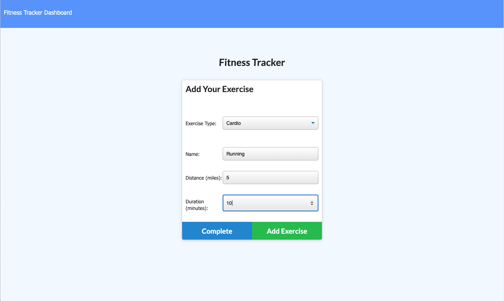
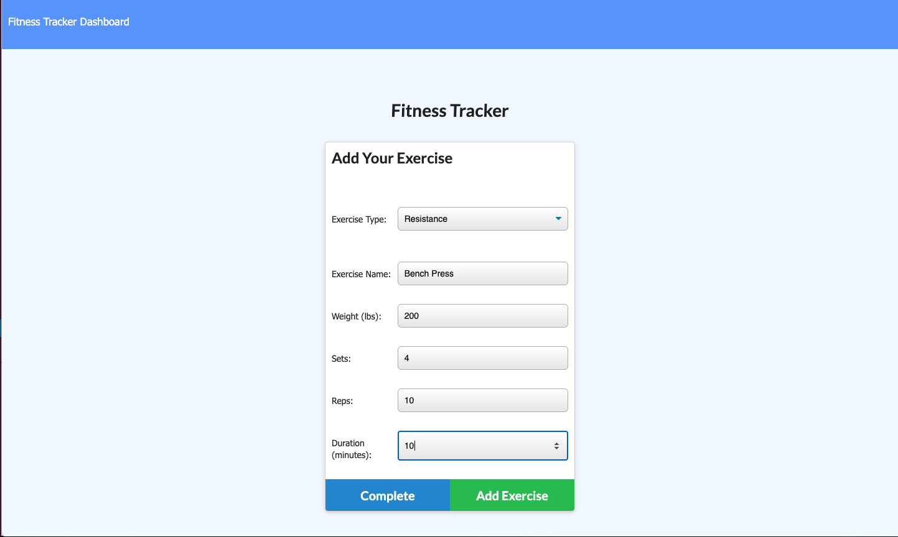
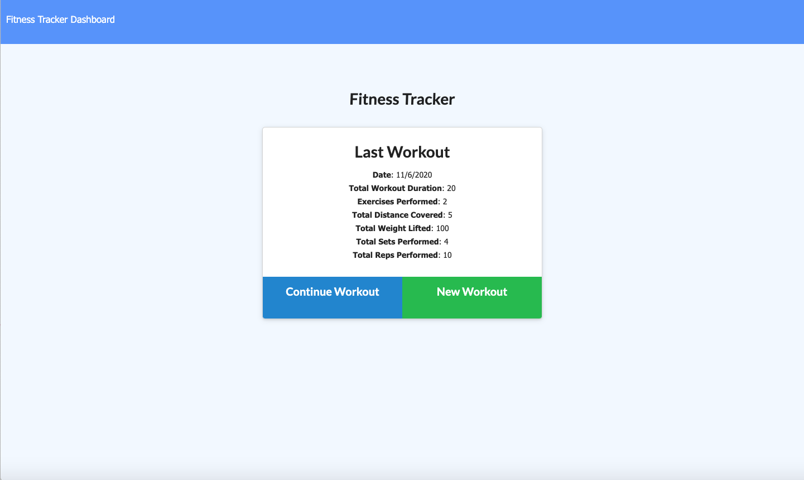
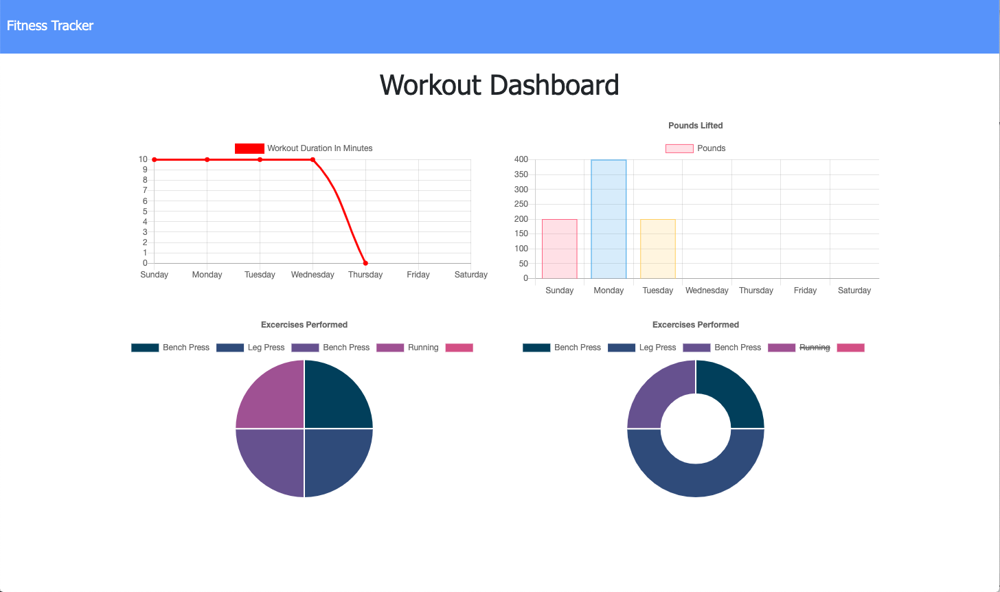

# 17-Fitness-Tracker

## Live site

Heroku:
https://stark-shore-15001.herokuapp.com/

GitHub:
https://github.com/theisen92/17-Fitness-Tracker

## Usage

Usage would be creating and tracking your fitness plan

## Credits

I primarily used the information from class activities and MDN Developer for resources. I also used stack overflow and github as references and to help with displaying the information

## Contributing

I worked on with one of my classmates

## Challenges

The main challenge that I was populating the models so that it would display the information from the new work out
I also had some trouble displaying the information on the main page and updating the status page

## Functionality

-Adding exercises 

- Workout summery

- Stats dashboard

